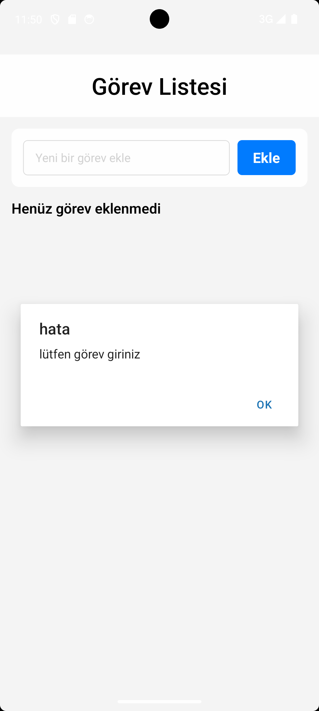
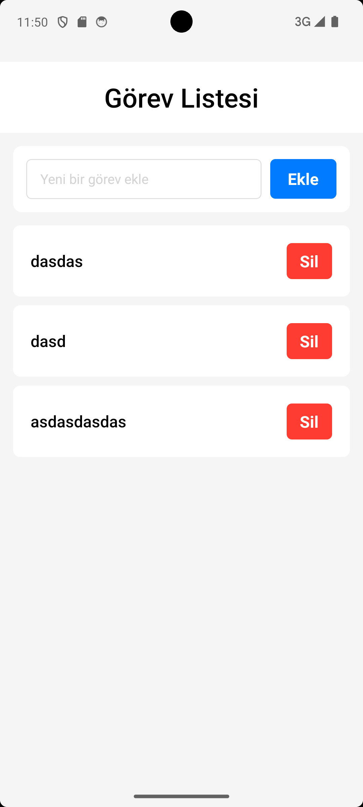

# Yapılacaklar Listesi (To-Do List) - React Native

Bu proje, React Native ile geliştirilmiş, kullanıcıların günlük görevlerini ekleyip silebildiği basit bir Yapılacaklar Listesi uygulamasıdır.

## 🚀 Özellikler

- Listeye yeni görevler ekleme.
- Mevcut görevleri listeden silme.
- Temiz ve anlaşılır kullanıcı arayüzü.

## 🛠️ Kullanılan Teknolojiler

- **React Native:** Mobil uygulama geliştirme çerçevesi.
- **JavaScript (ES6+):** Uygulama mantığı.
- **React Hooks (`useState`):** Görev listesini (dizi) ve input alanını yönetmek için.
- **`TextInput`:** Kullanıcıdan görev girişi almak için.
- **`FlatList`:** Görevleri ekrana listelemek için.
- **Flexbox:** Arayüz tasarımı ve stil.

## 📸 Ekran Görüntüsü

 | 